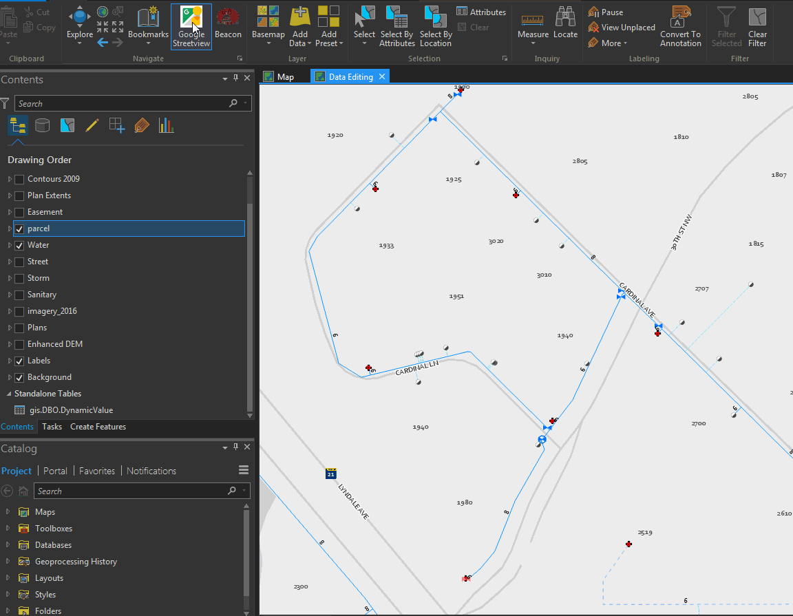
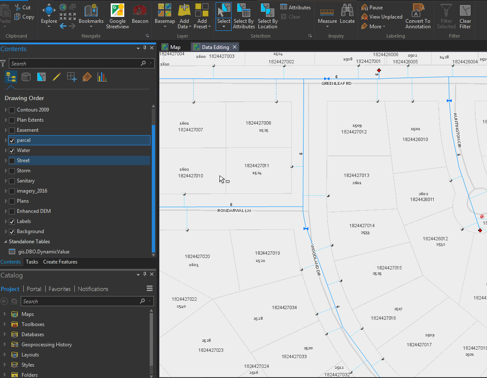

Pro Addins
==========

A collection of ArcGIS Pro buttons bundled into an addin.

**Note: when running pro, you will see an update notification every time. This is harmless and will be resolved in a future release.**

## Streetview

Open Google streetview on a map click point

## Definition Query Buttons

Buttons to set a definition expression on a layer to the selected features. Similar to Create layer from selection. The only difference is the definition query is placed on the selected layer, not on a newly created layer.

## External Viewer Button

A configureable button that allows a user to open an external application using an ID property and a url.

This button is configurable and the following can be provided using the Pro Options dialog.

 - Application URL: The url to the application. Be sure to include the text {0} which will be replaced with the ID property of the selected feature
 - Layer ID Field: The field name to query in the selected feature
 - Layer Name: The name of the layer to query in the map

## Credits:

[Pro evergreen](https://github.com/steveoh/pro-evergreen) - Auto update functionality
